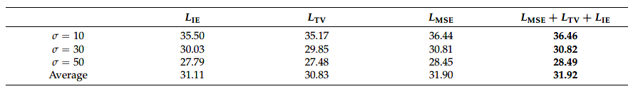

# UWNGN
The code and results of the proposed method in [UWMGN](https://www.mdpi.com/2076-3417/12/12/6227).

# Results

- Average performance of various combinations on 10 commonly used images with noise level 30.

- Average performance of different numbers of combinations on 10 commonly used image with noise level 30.

- Average PSNR values obtained by selecting different combinations of loss functions on 10 commonly used test images corrupted by different noise levels.

- Average performance of various combination strategies for different noise levels.

- Average PNSR results of different denoising methods on 10 commonly used images with various noise levels.

- Average performance of various methods on BSD with different noise levels.

- Denoising results of Couple image with noise level σ = 30.

- Denoising results of Hill image with noise level σ = 30.

- Denoising results of a color image with noise level σ = 30.
